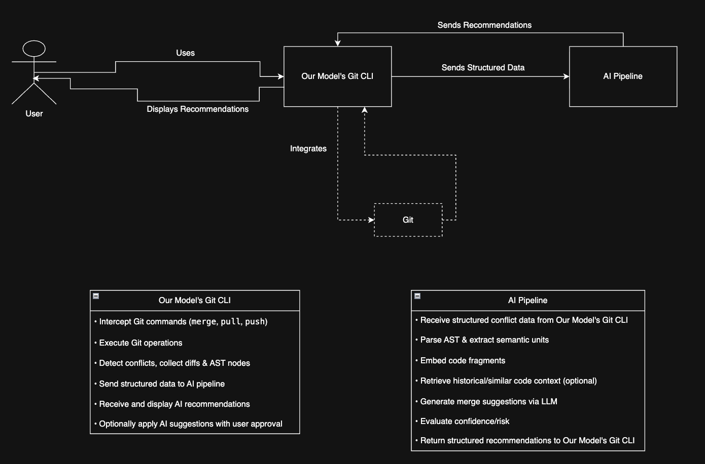

# Fancy Git



A smart CLI tool that provides intelligent recommendations and helps solve merge conflicts by analyzing git command outputs.

## Overview

FancyGit is a CLI wrapper around git commands that:
- Runs git commands and captures their output
- Detects warnings and errors in real-time
- Provides user confirmation for clean operations
- Prepares for AI-powered recommendations (future phase)

## Current Implementation (Phase 1)

### ✅ Features Implemented
- **CLI Interface**: `fancygit` command works system-wide
- **Enhanced Git Commands**: Support for 50+ git commands with intelligent error detection
- **AI-Powered Analysis**: Ollama integration for intelligent error analysis and recommendations
- **Repository Insights**: Generate statistics and visualize repository structure
- **Warning/Error Detection**: Regex-based pattern matching for common git issues
- **User Confirmation**: Prompts for confirmation when no issues detected
- **Colored Output**: Configurable colorized terminal output
- **Cross-platform**: Works on macOS, Linux, and Windows

### 🔍 Detection Patterns

**Error Patterns:**
- `error:`, `fatal:`, `failed`, `rejected`
- `conflict`, `merge conflict`, `unable to`

**Warning Patterns:**
- `warning:`, `WARNING:`, `behind`, `ahead`, `diverged`

## Installation

### Quick Setup

Run the automated cross-platform launcher script:
```bash
python3 launcher.py
```

This script will:
- Automatically detect your operating system (Linux, macOS, or Windows)
- Run the appropriate installation script for your system
- Check Python 3.6+ and Git installation
- Make fancygit.py executable
- Create system-wide symlink (Unix-like systems) or add to PATH (Windows)
- Test the installation

## Usage

### Standard Git Commands (Enhanced)
```bash
# Add files
fancygit add .
fancygit add filename.txt

# Commit changes
fancygit commit -m "Your commit message"
fancygit commit --amend

# Push to remote
fancygit push origin main

# Pull from remote  
fancygit pull origin main

# With additional arguments
fancygit push origin main --force-with-lease
fancygit pull origin main --rebase
```

### 🚀 Exclusive FancyGit Commands
These commands are unique to FancyGit and not available in standard git:

#### **Configuration & Settings**
```bash
# Toggle confirmation prompts for clean operations
fancygit confirmation [on|off|toggle|status]

# Enable/disable colored output
fancygit colors [on|off|toggle|status]

# Show welcome message
fancygit welcome
```

#### **AI-Powered Analysis**
```bash
# AI error analysis (requires Ollama)
fancygit ai [on|off|toggle|status]
fancygit ai models                    # List available AI models
fancygit ai model=<model_name>        # Switch to specific AI model
fancygit ai animation=<type>          # Set loading animation (run|dots|progress|matrix|brain)
```

#### **Repository Insights**
```bash
# Generate repository statistics and insights
fancygit insights [--days=N] [--format=console|json] [--output=filename]

# Visualize repository structure as Mermaid diagram
fancygit visualize [directory] [--max-commits=N] [--no-open]
```

### How It Works

1. **Command Execution**: Runs the actual git command
2. **Output Analysis**: Scans stdout/stderr for warning/error patterns
3. **User Feedback**: 
   - If issues detected: Shows detailed error/warning messages
   - If no issues: Prompts for confirmation with "enter 'y' to run the command"
4. **Action**: Executes or cancels based on user input

### Example Output

**No Issues:**
```
Running: git push origin main
✅ No warnings or errors detected
No warning messages - enter 'y' to run the command: y
Command executed successfully!
```

**Issues Detected:**
```
Running: git pull origin main
❌ Errors detected:
    error: couldn't find remote ref refs/heads/main
```

## Architecture

```
FancyGit CLI → Git Commands → Collect Output → Pattern Matching → User Interface (CLI)
```

## Current Status

### ✅ Completed Features
- **Phase 1**: CLI wrapper with intelligent error detection ✅
- **Phase 2**: AI-powered analysis and recommendations ✅
- **Repository Insights**: Statistics and visualization ✅

### 🚧 Future Enhancements
- **Phase 3**: Automatic conflict resolution suggestions
- Enhanced AI model integration
- Integration with more Git workflows
- Web-based repository visualization

## File Structure

```
Fancy_Git/
├── fancygit.py          # Main CLI application
├── launcher.py          # Cross-platform launcher script
├── welcome.py           # Welcome message display
├── README.md            # This file
├── requirements.txt     # Python dependencies
├── requirements-dev.txt # Development dependencies
├── setup.py            # Package setup configuration
├── Makefile            # Build automation
├── pytest.ini         # Test configuration
├── .gitignore          # Git ignore patterns
├── .fancygit_config    # FancyGit configuration file
├── VERSION             # Version information
├── command-list.txt    # Available commands list
├── images/              # Images and documentation
│   └── overview.png     # Project overview image
├── scripts/             # Utility scripts
│   └── send_email_notification.py
├── src/                 # Source modules
│   ├── __init__.py
│   ├── colors.py
│   ├── git_error.py
│   ├── git_error_parser.py
│   ├── git_insights.py
│   ├── git_runner.py
│   ├── ollama_client.py
│   ├── output_colorizer.py
│   └── repo_visualizer.py
├── tests/               # Test suite
│   ├── __init__.py
│   ├── conftest.py
│   ├── test_conflict_parser.py
│   ├── test_conflict_parser_integration.py
│   ├── test_git_error.py
│   ├── test_git_insights.py
│   ├── test_repo_state.py
│   └── test_repo_visualizer.py
├── htmlcov/            # Test coverage reports
├── .github/            # GitHub workflows
│   └── workflows/
│       └── ci-cd.yml
└── .git/               # Git repository
```
## Requirements

- Python 3.6+
- Git installed and configured
- System permissions for symlink creation
- **Optional for AI features**: Ollama installed and running for AI analysis
- **Dependencies**: See `requirements.txt` for package list 

## License

Copyright © 2026 Youssif Ashmawy and Omar Ossama

Licensed under the Apache License, Version 2.0 (the "License");
you may not use this file except in compliance with the License.
You may obtain a copy of the License at

    http://www.apache.org/licenses/LICENSE-2.0

Unless required by applicable law or agreed to in writing, software
distributed under the License is distributed on an "AS IS" BASIS,
WITHOUT WARRANTIES OR CONDITIONS OF ANY KIND, either express or implied.
See the License for the specific language governing permissions and
limitations under the License.
